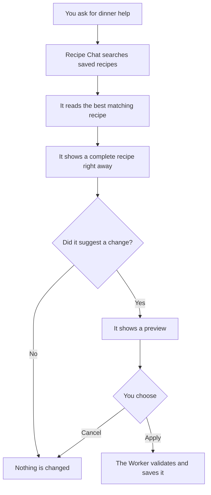

# Recipe Chat Agent, Explained Like You Are Five

Imagine Recipe Chat is a helpful cook standing in your kitchen.

The cook can talk with you, look inside your recipe box, and peek at your dinner calendar. The cook cannot secretly change anything. When the cook wants to change a recipe or plan a meal, it must show you a preview and wait for you to press **Apply**.

## The brain

The cook's brain is **GPT-5.6 Luna** from OpenAI. The application uses the OpenAI Agents SDK to connect that brain to a small set of tools.

The API key stays inside the Cloudflare Worker. It is never sent to the browser.

## The three tools

Recipe Chat has three read-only tools:

1. **Search saved recipes** (`search_saved_recipes`)
   - Looks through the recipe box.
   - Returns matching saved recipes.
   - The agent searches here before recommending a recipe.

2. **Read a saved recipe** (`read_saved_recipe`)
   - Opens one recipe by its real database ID.
   - Reads its ingredients, directions, servings, times, tags, and other saved details.
   - The agent must use this before adapting a saved recipe.

3. **Read the meal plan** (`read_meal_plan`)
   - Opens one Sunday-to-Saturday meal-plan week.
   - Reads the planned dinners and grocery list.
   - This lets the agent avoid guessing what is already planned.

These tools can look, but they cannot write.

## How a chat turn works

The answer arrives as a stream, so words can appear while the agent is working. You can press **Stop** to cancel the current response.

## What the agent can suggest

The agent can prepare three kinds of preview:

- **Recipe variation:** Makes an adapted copy of a saved recipe. The original recipe stays unchanged, and the new recipe remembers which recipe it came from.
- **Meal-plan assignment:** Suggests putting a real saved recipe on a particular day.
- **Grocery update:** Suggests regenerating a week's grocery list and leaving out named items.

A preview is only a piece of paper saying, “Here is what I want to do.” It does nothing until you press **Apply**.

## Safety checks

Before showing or applying a preview, the Worker checks the database itself:

- A cited recipe ID must really exist.
- A variation must point to a real saved recipe.
- Recipe timestamps come from the database, not from the model.
- Meal-plan revision numbers come from the database, not from the model.
- An old preview is rejected if the recipe or meal plan changed.
- A preview can be applied only once.
- An invented recipe ID is discarded.

These checks are like an adult checking the cook's work before anything is put away.

## What happens when no saved recipe fits

The agent first searches the saved recipes. If an occasion-specific search finds nothing, it tries broader food words. If the recipe box still has no good match, the agent may use general cooking knowledge to show a complete original recipe.

The answer tells you where its information came from:

- **From your saved recipes**
- **General cooking guidance**
- **Saved recipes + general cooking guidance**

An original recipe from general knowledge is shown in the conversation. The current setup does not save that original recipe directly. Saving from-scratch recipes would need another preview type and an explicit **Save recipe** action.

## Memory

Conversations, messages, citations, and previews are stored in the D1 database. This is why an old chat is still there after refreshing the page.

Deleting a conversation removes its saved messages and previews. Deleting the last conversation leaves a simple screen where you can start a new one.

## Where the pieces live

| Piece | File |
|---|---|
| Agent instructions and read tools | `worker/services/ai/recipe-agent.ts` |
| Chat API and streamed events | `worker/routes/recipe-chat-assistant.ts` |
| Apply and Cancel behavior | `worker/services/recipe-chat-actions.ts` |
| Conversation storage | `worker/repositories/recipe-chat-conversations.ts` |
| Browser API client | `src/services/recipe-chat.ts` |
| Chat screen | `src/pages/RecipeChatPage.tsx` |
| Chat types | `src/domain/recipe-chat.ts` |
| D1 tables | `migrations/0014_recipe_chat_assistant.sql` |
| Model setting | `wrangler.jsonc` |

## The short version

Recipe Chat is a talking cook with three library cards. It can look in the recipe box, open a recipe, and read the dinner calendar. It shows its work, asks before changing anything, and the Worker checks that every recipe and plan is real.
